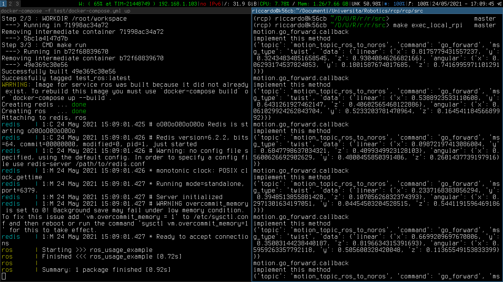
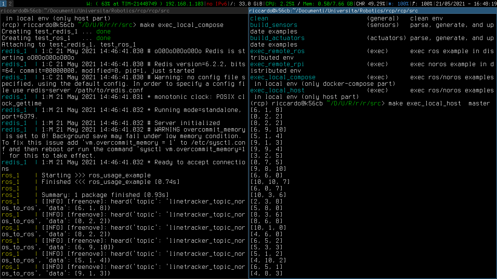
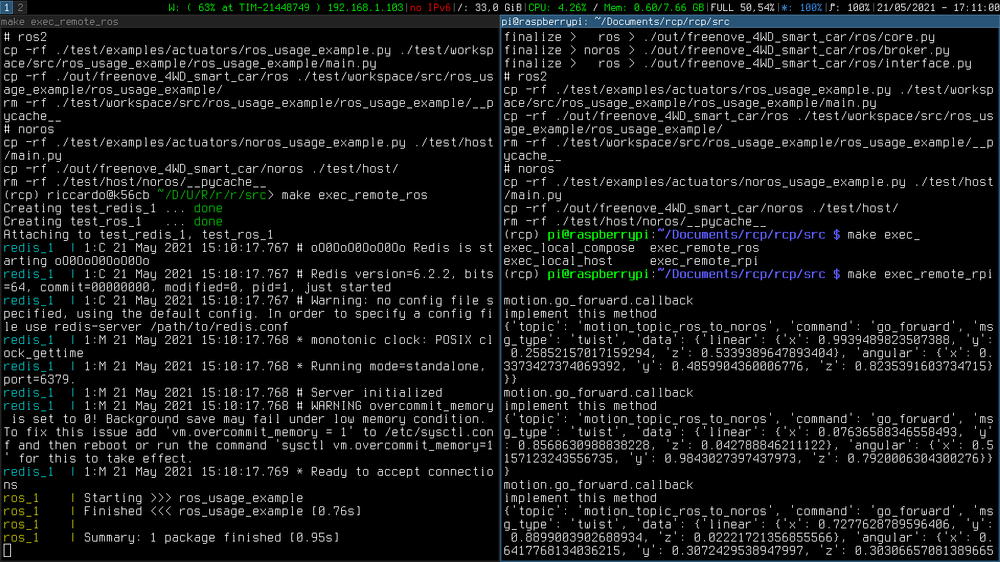
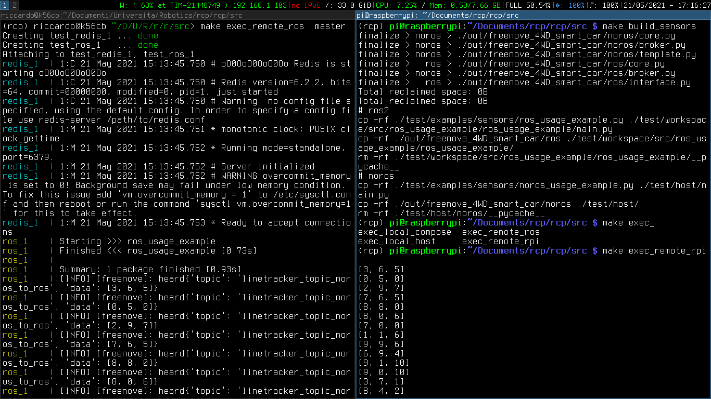
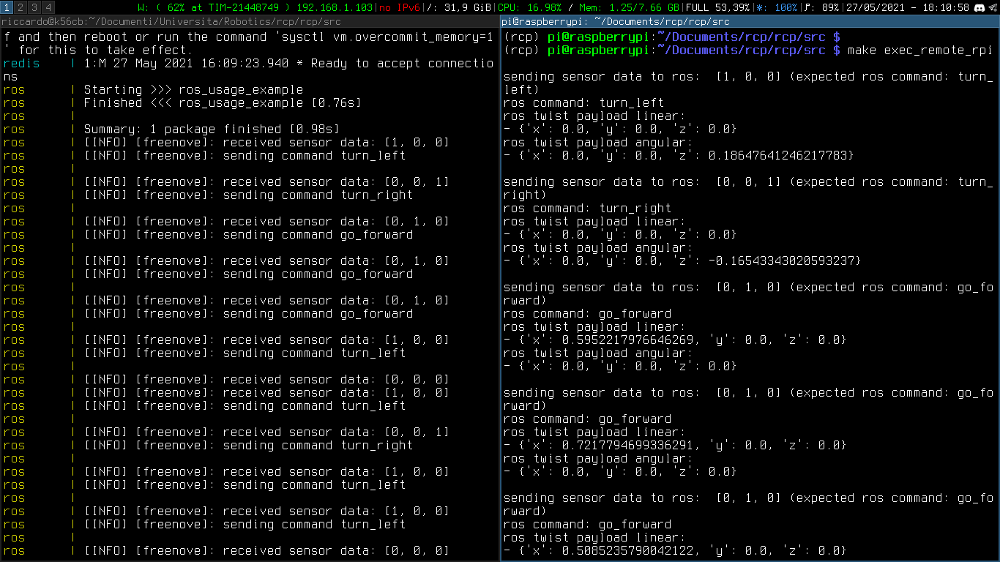

# RCP

you can follow this usage examples in order to test rcp.

remember that it is a best practise to perform a [cleaning step](#clean-the-rcp-workspace) if you are switching between examples or if you are experiencing some errors.


## 1. Pull this repository

```console
user@host:~$ git clone https://github.com/mdegree-nedas/rcp.git
```
- we will refer the git downloaded directory (the root of this repository) as ```<rcp-repo>```

## 2. Enter in the repository
```console
user@host:~$ cd <rcp-repo>
```

## 3. Mount and source the Python virtual environment
```console
user@host:~$ make rcp
user@host:~$ cd rcp
user@host:~$ . bin/activate
user@host:~$ cd src
```

## 4. Execute examples
- you need two terminals to execute the examples.
- thus, you have to open a new terminal and in this new terminal you have to follow the steps that you have already followed with one terminal.
- as a reminder: you have to follow the steps written in the sections [enter in the repository](#2-enter-in-the-repository) and [mount and source the Python virtual environment](#3-mount-and-source-the-python-virtual-environment)
- now, you are ready to test our examples

### Example 1: actuators (both ROS and host are in the same machine)
- we assume that you have two terminals. In one terminal we will execute the ROS part and in the other one we will execute the host part
- we assume that in both terminals you have already [mounted and sourced the Python virtual environment](#3-mount-and-source-the-python-virtual-environment)
- we assume that in both terminals you are already in the directory ```<rcp-repo>/rcp/src```
- terminal 1: ROS part
```console
user@host:~$ make build_actuators
user@host:~$ docker-compose -f test/docker-compose.yml up
```

- terminal 2: host part (execute this when the ROS part is ready)
```console
user@host:~$ make exec_local_rpi
```

- example result screenshot:
	- on the left, the ROS part terminal
	- on the right, the host part terminal




### Example 2: sensors (both ROS and host are in the same machine)
- we assume that you have two terminals. In one terminal we will execute the ROS part and in the other one we will execute the host part
- we assume that in both terminals you have already [mounted and sourced the Python virtual environment](#3-mount-and-source-the-python-virtual-environment)
- we assume that in both terminals you are already in the directory ```<rcp-repo>/rcp/src```
- terminal 1: ROS part
```console
user@host:~$ make build_sensors
user@host:~$ docker-compose -f test/docker-compose.yml up
```

- terminal 2: host part (execute this when the ROS part is ready)
```console
user@host:~$ make exec_local_rpi
```

- example result screenshot:
	- on the left, the ROS part terminal
	- on the right, the host part terminal




### Example 3: actuators (ROS in a linux/amd64 machine and host in a linux/arm/v7 Raspberry machine)
- we assume that you have already pulled the repository in the two machines and you have one terminal opened in the linux/amd64 machine and the other terminal opened in the Raspberry machine
- we assume that in both terminals you have already [mounted and sourced the Python virtual environment](#3-mount-and-source-the-python-virtual-environment)
- we assume that in both terminals you are already in the directory ```<rcp-repo>/rcp/src```

#### preparation step
the robot configuration file must contain the IP of your linux/amd64 machine that contains the ROS part and the exposed PORT in which the redis service is running:
- open the robot configuration file config/freenove.yml with your preferred text editor and:
	- set the field "message_broker_ip", in this field you must put the IP of the linux/amd64 machine
	- set the field "message_broker_port", in this field you must put the exposed PORT in which the redis service is running

#### execution
- we assume that in the robot configuration file config/freenove.yml you have already set the correct IP in the "message_broker_ip" field and the correct PORT in the "message_broker_port" field

- terminal 1: ROS part (linux/amd64 machine)
```console
user@host:~$ make build_actuators
user@host:~$ docker-compose -f test/docker-compose.yml up
```

- terminal 2: host part (execute this when the ROS part is ready)
```console
user@host:~$ make build_actuators
user@host:~$ make exec_remote_rpi
```

- example result screenshot:
	- on the left, the ROS part terminal (in the linux/amd64 machine)
	- on the right, the host part terminal (in the linux/arm/v7 Raspberry machine)




### Example 4: sensors (ROS in a linux/amd64 machine and host in a linux/arm/v7 Raspberry machine)
- we assume that you have already pulled the repository in the two machines and you have one terminal opened in the linux/amd64 machine and the other terminal opened in the Raspberry machine
- we assume that in both terminals you have already [mounted and sourced the Python virtual environment](#3-mount-and-source-the-python-virtual-environment)
- we assume that in both terminals you are already in the directory ```<rcp-repo>/rcp/src```

#### preparation step
the robot configuration file must contain the IP of your linux/amd64 machine that contains the ROS part and the exposed PORT in which the redis service is running:
- open the robot configuration file config/freenove.yml with your preferred text editor and:
	- set the field "message_broker_ip", in this field you must put the IP of the linux/amd64 machine
	- set the field "message_broker_port", in this field you must put the exposed PORT in which the redis service is running

#### execution
- we assume that in the robot configuration file config/freenove.yml you have already set the correct IP in the "message_broker_ip" field and the correct PORT in the "message_broker_port" field

- terminal 1: ROS part (linux/amd64 machine)
```console
user@host:~$ make build_sensors
user@host:~$ docker-compose -f test/docker-compose.yml up
```

- terminal 2: host part (execute this when the ROS part is ready)
```console
user@host:~$ make build_sensors
user@host:~$ make exec_remote_rpi
```

- example result screenshot:
	- on the left, the ROS part terminal (in the linux/amd64 machine)
	- on the right, the host part terminal (in the linux/arm/v7 Raspberry machine)




### Example 5: loop (both ROS and host are in the same machine)
- we assume that you have two terminals. In one terminal we will execute the ROS part and in the other one we will execute the host part
- we assume that in both terminals you have already [mounted and sourced the Python virtual environment](#3-mount-and-source-the-python-virtual-environment)
- we assume that in both terminals you are already in the directory ```<rcp-repo>/rcp/src```
- terminal 1: ROS part
```console
user@host:~$ make build_loop
user@host:~$ docker-compose -f test/docker-compose.yml up
```

- terminal 2: host part (execute this when the ROS part is ready)
```console
user@host:~$ make exec_local_rpi
```

- example result screenshot:
	- on the left, the ROS part terminal
	- on the right, the host part terminal


- example realtime walkthrough gif:


### Example 6: loop (ROS in a linux/amd64 machine and host in a linux/arm/v7 Raspberry machine)
- we assume that you have already pulled the repository in the two machines and you have one terminal opened in the linux/amd64 machine and the other terminal opened in the Raspberry machine
- we assume that in both terminals you have already [mounted and sourced the Python virtual environment](#3-mount-and-source-the-python-virtual-environment)
- we assume that in both terminals you are already in the directory ```<rcp-repo>/rcp/src```

#### preparation step
the robot configuration file must contain the IP of your linux/amd64 machine that contains the ROS part and the exposed PORT in which the redis service is running:
- open the robot configuration file config/freenove.yml with your preferred text editor and:
	- set the field "message_broker_ip", in this field you must put the IP of the linux/amd64 machine
	- set the field "message_broker_port", in this field you must put the exposed PORT in which the redis service is running

#### execution
- we assume that in the robot configuration file config/freenove.yml you have already set the correct IP in the "message_broker_ip" field and the correct PORT in the "message_broker_port" field

- terminal 1: ROS part (linux/amd64 machine)
```console
user@host:~$ make build_loop
user@host:~$ docker-compose -f test/docker-compose.yml up
```

- terminal 2: host part (execute this when the ROS part is ready)
```console
user@host:~$ make build_loop
user@host:~$ make exec_remote_rpi
```

- example result screenshot:
	- on the left, the ROS part terminal (in the linux/amd64 machine)
	- on the right, the host part terminal (in the linux/arm/v7 Raspberry machine)




## Inspect Redis traffic
- we assume that you have already a second terminal opened in the same machine that runs the ROS part
```console
user@host:~$ docker exec -it redis redis-cli monitor
```


## Clean the rcp workspace
- we assume that you have already a terminal opened in the directory ```<rcp-repo>/rcp/src```
- we assume that you have already [mounted and sourced the Python virtual environment](#3-mount-and-source-the-python-virtual-environment)
```console
user@host:~$ make clean
```


## Deactivate the Python virtual environment
- you want to execute this step if you are exiting the repository
- we assume that you have already [cleaned the rcp workspace](#clean-the-rcp-workspace)
- we assume that you have already the terminal opened in the directory ```<rcp-repo>```
- we assume that you have already [mounted and sourced the Python virtual environment](#3-mount-and-source-the-python-virtual-environment)
```console
user@host:~$ deactivate
user@host:~$ make clean
```

## Troubleshooting
- if you are experiencing some errors while executing the examples, [cleaning](#clean-the-rcp-workspace) the rcp workspace maybe will help. 
- if your terminal with docker-compose is not showing results in our sensors examples, try waiting a little more. We have noticed that docker-compose tend to flush the results after some seconds.
